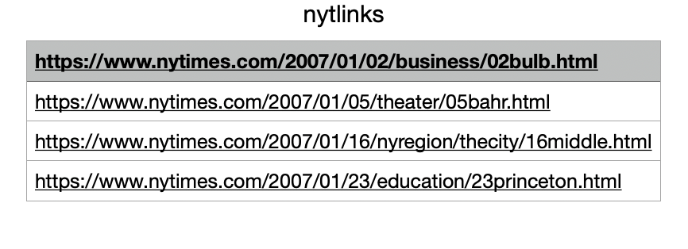
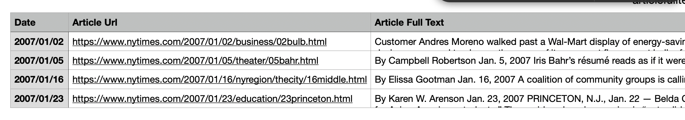

# Scraping NYT Using Beautiful Soup

## Setup 
After you have created a spreadsheet using the python programs for NYT searching, you may want to find the full text of these articles. 

To do this, first select the column that contains the urls you want to scrape and copy it into a new spreadsheet. The new file should have just the one column containing the urls you want to visit. It should look like this:



Using either Export or Save As, save this file as a `.csv` file with a name like `nytlinks.csv`. Put it in a new, empty folder called "NYT Scraping."

Download to this folder the following file titled `nytscraper.py`: [link to the file.]

Open the Terminal and run the following commands: [import/download relevant python stuff, bs stuff, etc.]

To complete the setup, open a text editor (TextEdit will work fine) and save an empty file with the name `articlefulltext.csv`. (Once this file is populated with information, you can rename it and move it elsewhere. For now though it has to have this specific name so that the program can find it.) Make sure it is also saved to the "NYT Scraping" folder.

## Running the File 

Navigate in the terminal to the "NYT Scraping" folder, either by right clicking and selecting "New Terminal at Folder" or by using `cd` commands to navigate to it. (For example, if it was in your documents folder, you would start with the command `cd Documents` and then type `cd "NYT Scraping`).

Now type or paste into the terminal this command to run the program:

```
python3 nytscraper.py
```

and press enter. It may take a moment for the program to run. You'll know it's done when the terminal prints "Done Scraping!"

Now open the file `articlefulltext.csv`. You should see it populated with three columns: date, url, and full text, like this:



You can now save this file with a new name and proceed as you want with it! 

